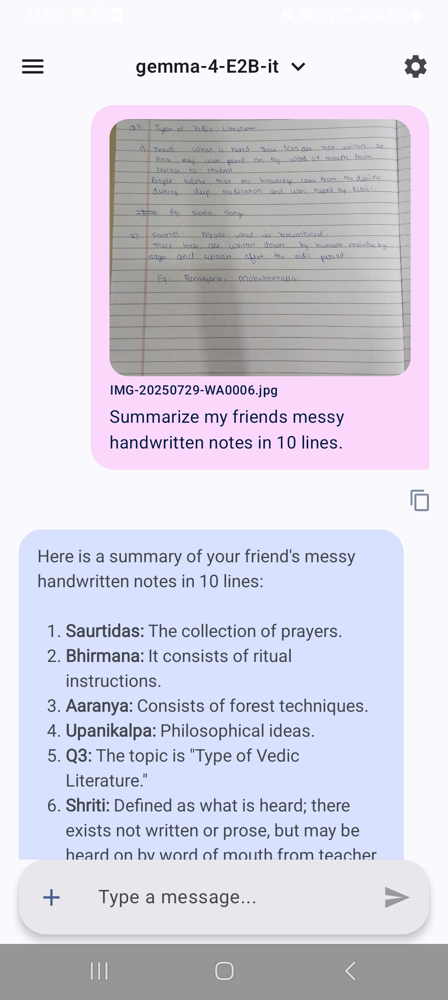
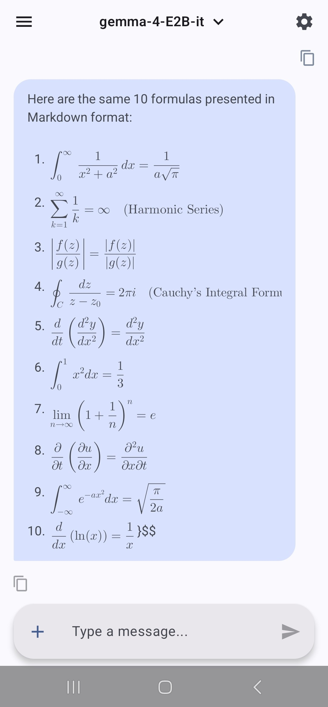
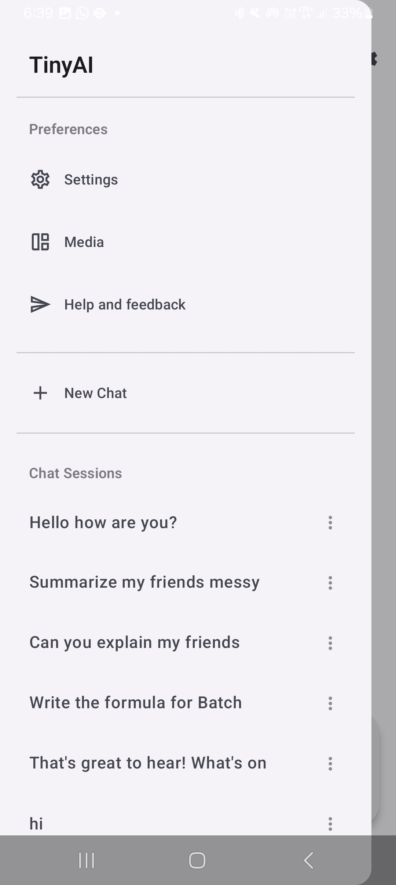
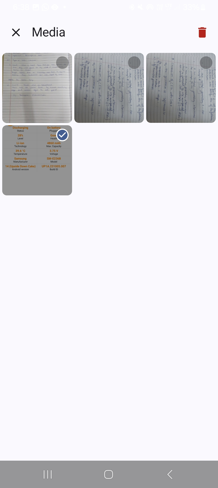
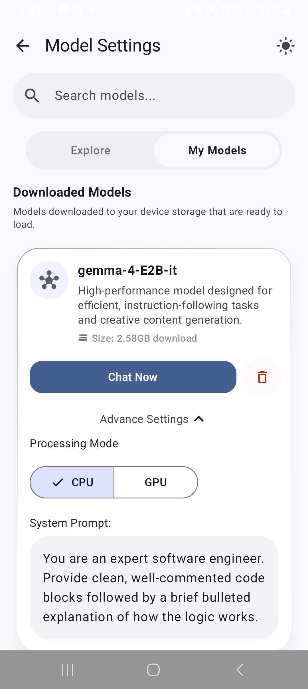
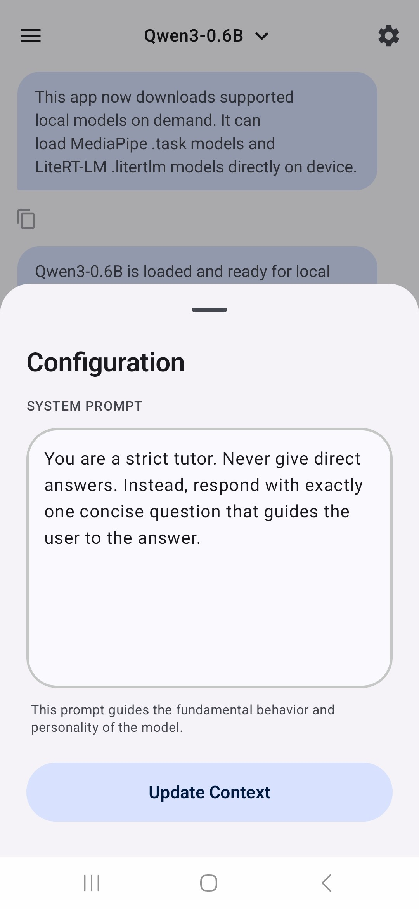
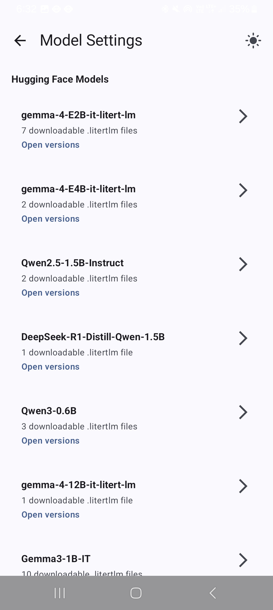
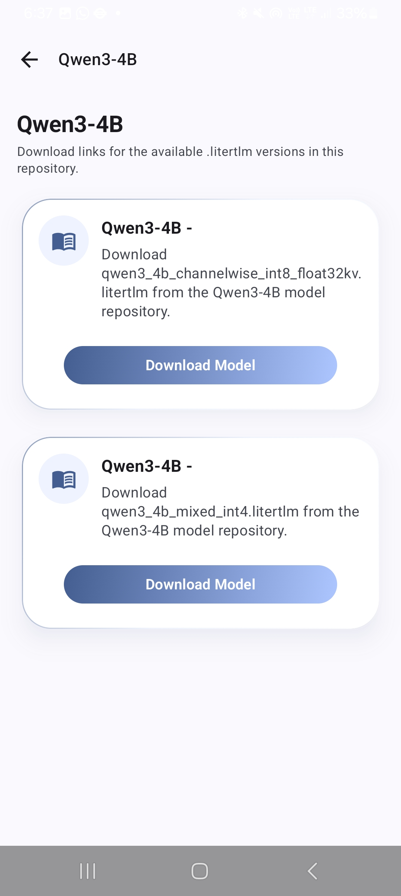

<p align="center">
  
</p>

<h1 align="center">TinyAI</h1>

<p align="center">
  
  
  
  
  
</p>

**TinyAI** is an Android app for running large language models entirely on-device. No API keys, no servers, no data leaving your phone. Download a model once and chat with it fully offline.

It runs on two local inference engines (Google's MediaPipe GenAI and LiteRT-LM), lets you pull additional compatible models straight from Hugging Face, and supports both text and vision prompts depending on what the loaded model can handle.

## Screenshots

<table>
  <tr>
    <td></td>
    <td></td>
    <td></td>
    <td></td>

  </tr>
  <tr>
    <td></td>
    <td></td>
    <td></td>
    <td></td>
  </tr>
</table>

## Why TinyAI

Most AI chat apps route every message through a cloud API. TinyAI does the opposite: once a model is downloaded, every single response is generated on your device's own CPU or GPU. That means it keeps working in airplane mode, your conversations never touch a server, and there's no per-message cost.

## Features

- **Fully on-device inference** through MediaPipe GenAI (`.task`) or LiteRT-LM (`.litertlm`) models.
- **Automatic runtime selection**, so you don't need to configure which engine a model uses.
- **CPU / GPU backend switching**, remembered per model.
- **Vision support** on models that allow it. The attachment button enables itself automatically when a vision-capable model is loaded.
- **Hugging Face model browsing**, so you're not limited to the built-in curated list.
- **Reasoning model support** for models like DeepSeek-R1 and Qwen3 that emit a `<think>` block. The reasoning is parsed out and shown separately from the final answer as it streams in.
- **Streaming responses** that can be stopped mid-generation.
- **Per-model system prompts**, saved along with each chat session.
- **Multi-session chat history**, stored locally in a Room database, including any attached images.
- **A dedicated media gallery** for every image sent or received in a chat, with multi-select delete and a pinch-to-zoom preview.
- **Markdown and LaTeX rendering** in chat responses, powered by Markwon.

## Features Overview

| Feature                     | Supported |
|------------------------------|-----------|
| Offline inference            | Yes       |
| Vision models                | Yes       |
| Streaming responses          | Yes       |
| Stoppable generation         | Yes       |
| CPU / GPU switching          | Yes       |
| Hugging Face model downloads | Yes       |
| Reasoning / thinking display | Yes       |
| Multi-session chat history   | Yes       |
| Per-model system prompts     | Yes       |
| Markdown + LaTeX rendering   | Yes       |
| GGUF model support           | No        |
| Cloud sync                   | No        |

## Supported Model Formats

| Runtime         | Format      |
|------------------|-------------|
| MediaPipe GenAI  | `.task`     |
| LiteRT-LM        | `.litertlm` |

## Tech Stack

| Layer           | Technology                                     |
|-------------------|-------------------------------------------------|
| Language         | Kotlin                                         |
| UI               | Jetpack Compose, Navigation 3                  |
| Local inference  | MediaPipe GenAI (`tasks-genai`), LiteRT-LM     |
| Networking       | Retrofit + Gson (Hugging Face model lookup)    |
| Persistence      | Room                                           |
| Image loading    | Coil                                           |
| Rich text        | Markwon (core, inline-parser, tables, LaTeX)   |
| Model downloads  | Android `DownloadManager`                      |

## Requirements

- A physical Android device or emulator running Android 7.0 (API 24) or higher.
- An internet connection to download models. Inference itself works fully offline once a model is downloaded.
- Enough free storage for the models you plan to use, typically 600 MB to 2.6 GB each.

## Building from Source

```bash
git clone https://github.com/YashBhadange2006/TinyAI.git
```

1. Open the cloned folder in the latest stable version of Android Studio.
2. Let Gradle sync and download dependencies.
3. Run the app on a physical device or emulator (API 24+).

## Usage

1. **Get a model.** Open Settings, browse the curated list or search Hugging Face, and download a model.
2. **Load it.** Once downloaded, tap Load to bring it into memory.
3. **Optional: set a system prompt.** Give the model a persona or a set of instructions to follow.
4. **Chat.** If the loaded model supports vision, the attachment button will be enabled automatically.
5. **Your sessions are saved automatically** and can be reopened from the side drawer at any time.

## Contributing

Contributions are welcome, whether that's a bug fix, a new feature, or an improvement to the inference layer.

1. Fork the repository and create a branch from `main`.
2. Make your changes, keeping commits focused and descriptive.
3. Test on a real device where possible, since local inference behaves differently across hardware.
4. Open a pull request describing what you changed and why.

If you find a bug or have an idea, feel free to open an issue first to discuss it before diving into a PR.

## License

This project is licensed under the Apache License 2.0. See [LICENSE](LICENSE) for details.

## Acknowledgements

- [MediaPipe GenAI](https://ai.google.dev/edge/mediapipe)
- [LiteRT-LM](https://github.com/google-ai-edge/LiteRT-LM)
- [Hugging Face](https://huggingface.co)
- [Markwon](https://noties.io/Markwon/)
